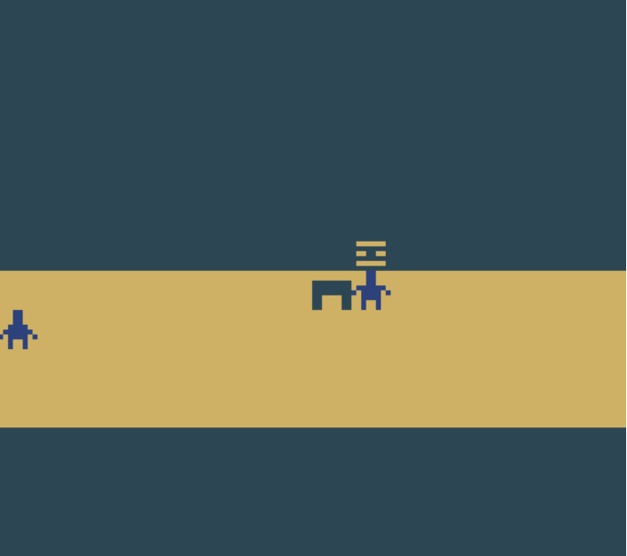

# process journal

# tinyGame!!| jan 23, 2025

I made a prototype game.

It was about breaking the matrix, also pretty short.

Seeing playtesting was really fun, watching people play and fid out that you could break the wall. 

I was told that my game is reminiscent of severance! And the stanley parable!!! Super flattering lol

**ahh!!**
_italics_

Jan 30 2025, class 3

Bedbugs! I couldnt make it to class. Really sucks.

# Feb 6 2025, class 4

No more bedbugs!

I'm in a predicament however. As i was not in the last class, i am kind of behind on the current assignment:

Exploration Prototype 2 - Using the material that we looked at this week (physics, object tags, scoring, sound, etc) experiment with a game prototype and then document the exploration. What is your idea? What are you trying to test? What did you learn? Was it successful? Where might you go next if you wanted to keep exploring this idea? If you are stuck, think about how you could change some of these things to make an experimental version of the Pawng game we created. For instance, what happens if some of the object attributes change over time? Or every time the ball bounces?

So… to catch up i will keep things simple and stripped down. I'm going to modify the game that we made in the 30th, which is catching balls and then they disappear into that they bounce with gravity and then make a “boing!” sound that i will generate with SFXR. currently i'm watching this:

[How To Add Sound Effects the RIGHT Way | Unity Tutorial](https://www.youtube.com/watch?v=6OT43pvUyfY)

Brackeys is awesome!!!!! Anyway i got it that when the balls spawn, they make a (annoying) noise! Now i'm gonna make it that it makes another sound when it hits the block.

Okay update……. I am very very very dumb. Very. 

I have been trying to make it that the circle makes a disappear sound, and i was trying again and again and again even though when i click on the script the sound is assigned…….

And then i just realized like right now that the script IN the gameobject needs a sound assigned 

AAHHHHHHH my god i spent 2 hours on that. Lesson well learned though!!!!! The thing makes a sound!!!! Holy shit!!!!

also.... i wannamake an agario clone.

# feb 13 2025, class 5

Sadly this week i dont have anything unity related however... i have a couple game concepts i have been thinking about lately:

I have been playing outer wilds recently, right now i'm playing the DLC. out of everything that game has to offer, i think the thing that is the most clever development wise is how “the stranger” is revealed to the player. (The stranger is the DLC addon in the game) the first time you search for it, you are at an angle that when you enter the space station, you reach a different entrance compared to every other time you enter. 

Sadly this is a pretty high level design idea that would take a lot of time to implement in a game, so i think i would be able to make it down the line. For now I only have a simple idea. 

Another idea i am not really sure how to approach in unity is a map design that is procedurally designed, meaning that no matter which way you go, a predetermined path would be laid for you. Honestly these ideas are pretty complicated so i will make something simpler and more in scope for next week.

# march 6 2025 extra credit

Find a game that you know well or are intrigued by.

I recently finished outer wilds + the DLC. 

 What decisions have the designers made that cause the game to be interesting? 

Having watched the mini documentary about the game, they explained that they made an extremely intentional effort to not hide things. As in wherever there is nothing interesting, there is truly nothing for you to discover. Too many games suffer from the opposite, like open world games, making you scour all corners of a giant map (korok seeds for example…) which to me is a huge time waster. Games should treat every moment of the players time as extremely precious, but that doesnt mean make everything super flashy. It just means make the game meaningful instead of making the game drone on.

Where have they failed? 

Great question! There were a few mechanics that go underutilized, like the player’s spaceship. Its essentially an extension of the player and nothing more. I wish i had seen some more uses of it, like dealing with more intricate minigames within the ship. 

Also it failed a lot with several key elements of the story being underexplained, like how the interloper (the comet with the ghost matter) hits the sun right as it goes supernova, which led me to believe that that was what caused the supernova. However that wasnt what did it and i had to look stuff up to actually get it.

There were also some guardrails put in place to make the game much easier to play, which i didnt really like. Especially because the game tries to kill you at any wrong turn, i found it annoying that the ship controls are sometimes tampered, preventing explosive deaths (like how the ship slows down automatically even with the autopilot off so you can land nicer)

Think mechanically rather than thematically. What ideas/methods/techniques do you think you could borrow for future projects?

Oh, A LOT! I definitely like the time loop mechanic. Very cool to be repeating the same experience especially because a lot of games have short sequences that go barely noticed and never used again. Being able to repeat the 22 minutes is an excellent way to make sure you dont miss any details of a certain moment.

Another is the versatility of the tools at hand. Specifically the radio scope and the probe. They both serve a lot of uses, for example, the probe is: 
    • A camera
    • A light source
    • A tracker
    • A surface integrity checker
    • A ghost matter detector

In my opinion, its an excellent way to not overwhelm the player but still give the player all the possible tools that they might need in their adventure.

I also like this ‘mechanic’ of being able to access literally everything from the start. Its the polar opposite of a locked door which says “come back later” (which i hate.) and embraces the idea of that the only thing to gain is knowledge.

Also the jump button is something so unique i haven't seen it in a game from what i can remember. In other first person games, pressing the jump button in any way will make you jump the same height every time. But outer wilds lets you hold the button, which lets you jump higher the longer you press it. Similar to a side scroller like mario bros. Which to me i felt it was weird for 5 seconds then i actually got used to it. I will definitely be taking that because its really satisfying.

# march 6 2025 iteration 1

Journal about the first stage of your prototyping process. 

What was your idea? 

 

Alex and i have this idea for a game called rock paper chess. 

 

Basically its chess in a 5x3 grid, with 2 rows of pieces for each side. Small chess.

 

Any time a player takes a piece, you are taken to a rock paper scissors game, and whoever is the winner takes the others piece and is now their turn. Simple but fun

What specific questions were you trying to answer (goals)? 

 

I love old games with a twist. Like balatro being solitaire poker! Or 5d chess. So i think this is a cool idea that will be unique.

 

Was it a look/feel, role, implementation prototype?

 

Mostly look and feel. A little role too though!

What fidelity levels are you dealing with? \

Honestly just so we have a working prototype as soon as possible it will look pretty crude at the start. However there is a lot of space for more improvement as time goes on

 

What did you learn and what are the next steps?

 

The hardest part is just starting! The next step is making each part. I will make the rock paper scissors and alex will make the chess section. Once both function somewhat individually, we will combine them and make the variables of each affect each other.

# march 13 2025 iteration 2

first, i gotta organize this journal. 

with that out of the way, ive made the UI of the rock paper scissors!
i changed to godot as i found unity sort of frustrating in some areas.

but..... check this out!!

the bottom 3 images are the user buttons, the middle is the result and the top will be the AI's choice.

still the code isnt finished, however by next week i should have some of the chess part completed as well. i will also be at GDC so it will be a little lackluster...

